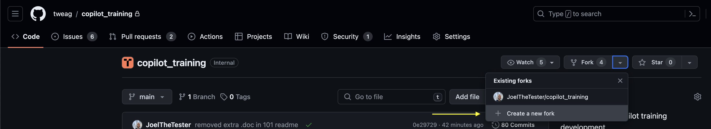
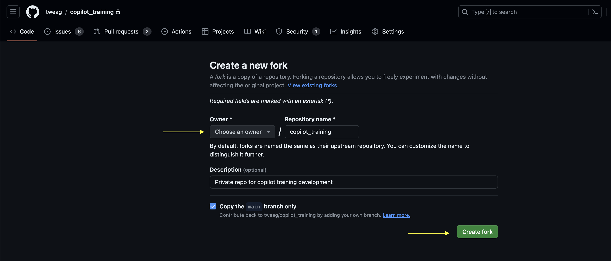

# Forking and Cloning the workshop repository
Now that we have a GitHub account, Copilot license, and VS Code installed, we will fork and clone the repository. 

## Forking the workshop repository
Follow these steps to fork the repository on GitHub:

1. Log in to GitHub
2. Navigate to the Modus Create GitHub Copilot training repository shared with you by your organization. 
3. Click on the `Fork` button -> Click `+ Create a new fork`

4. Select your account from the `Owner` dropdown, then click `Create fork`



### Cloning the forked repository 
Follow these steps to clone the repository:

1. Use the following command to create a new directory to house our project:

```console
mkdir copilot_workshop 
```

2. Use the following commands to navigate into this folder and clone your forked repository. Note: Since you are cloning the forked repo from your GitHub account the url will look something like this `https://github.com/<your github handle>/copilot_training.git`

```console
cd copilot_workshop
```

```console
git clone <path to repo>
```

Your forked repo should now be located in `copilot_workshop/copilot_training` directory.


3. Set up your local development environment by following the instructions from the windows_setup.md or the mac_setup.md files, depending on the OS you are using.
